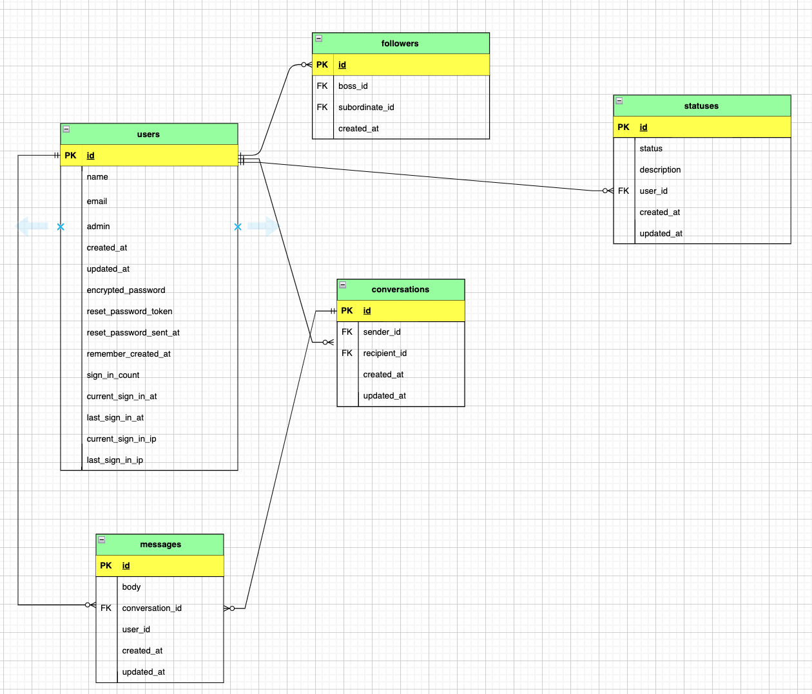
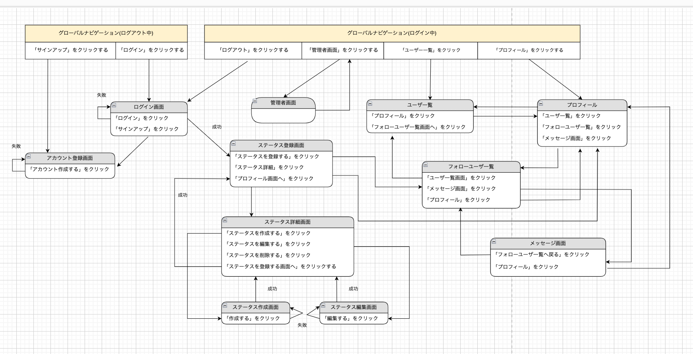

# README

## 開発言語
* Ruby 3.0.1
* Rails 6.1.6 

## 就業Termの技術
* devise
* フォロー機能
* メッセージ機能

## カリキュラム外
* onesignal

## 実行手順
* \$ git clone git@github.com:moritamasak/time_finder.git
* \$ cd time_finder
* \$ bundle install
* \$ yarn install
* \$ rails db:create && rails db:migrate
* \$ rails s

## カタログ設計
<https://docs.google.com/spreadsheets/d/1roSXpDzJa4Hw5SPabk5HXAA6oIvKnZsDS80ImJdgwu4/edit#gid=727687195>

## テーブル定義書
<https://docs.google.com/spreadsheets/d/11oixCsOERgFHlwqMmmhWhQQfa3uNQ6fx79Jjzqijc94/edit#gid=1091513276>

## ワイヤーフレーム
<https://app.diagrams.net/#G1cUKq-9DoV2fFSyfuyQ5boNd32hNXHDAX>

## ER図

## 画面遷移図

